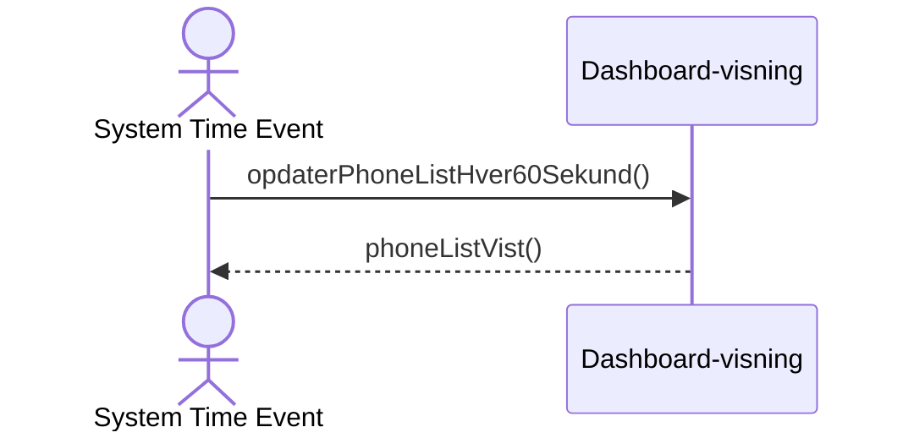

## Metadata
| Key            | Value             |
|----------------|-------------------|
| Id             | UC-005.SSD        |
| crossReference | UC-005 UC-005.DM  |
| Title          | Dashboard PhoneList |
| Author         | Team 6            |

## Version Log
| Version | Date       | Description | Author |
|---------|------------|-------------|--------|
| 0001    | 2026-04-02 | Initial     | Team 6 |

## System Sequence Diagram (Danish)

## Noter
- Scope er begrænset til dashboard-visningens interaktioner, ikke intern implementering.
- PhoneList er ikke en kontaktliste til at foretage opkald.
- Telefonnumre er faste og ændrer sig aldrig.
