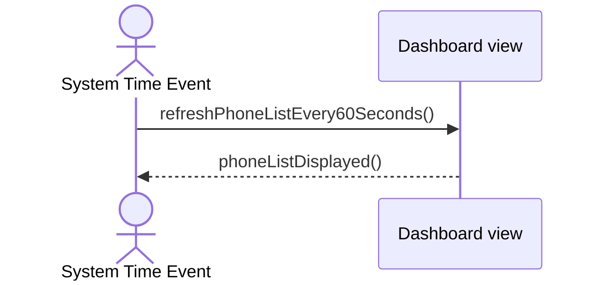

## Metadata
| Key            | Value             |
|----------------|-------------------|
| Id             | UC-005.SSD        |
| crossReference | UC-005 UC-005.DM  |
| Title          | Dashboard PhoneList |
| Author         | Team 6            |

## Version Log
| Version | Date       | Description | Author |
|---------|------------|-------------|--------|
| 0001    | 2026-04-02 | Initial     | Team 6 |

## System Sequence Diagram

## Notes
- Scope is limited to the dashboard view interactions, not internal implementation.
- PhoneList is not a contact list for making calls.
- Phone numbers are fixed and never change.
