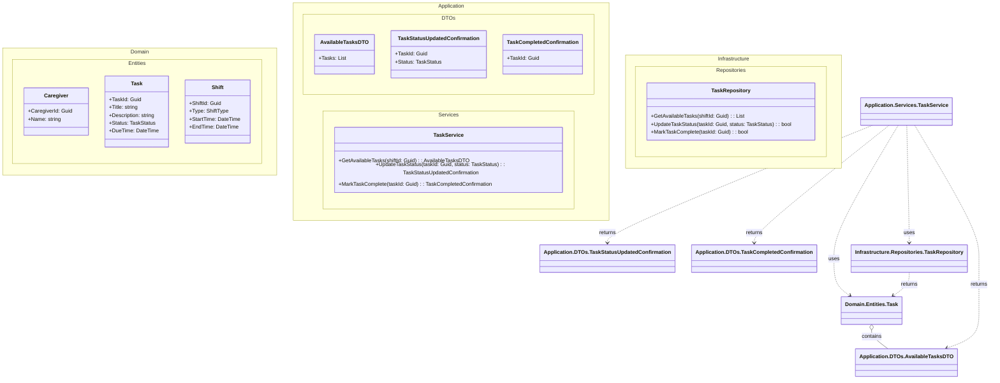

# Domain Class Diagram (DCD) for Dashboard TaskList
## Metadata
| Key               | Value                             |
|-------------------|-----------------------------------|
| Id                | UC-006.DCD                       |
| crossReference    | UC-006.SD, UC-006.DM             |

## Version Log
| Version | Date       | Description              | Author     |
|---------|------------|--------------------------|------------|
| 0001    | 2026-04-10 | Initial                  | Team 6     |

## Notes
- All classes are placed in namespaces matching Clean Architecture folder structure.
- DTOs are used for data transfer between layers.
- TaskStatus and ShiftType are assumed to be enums in Domain.Enums.
- TaskRepository abstracts all data access.
- No direct references from Domain to Application or Infrastructure.
