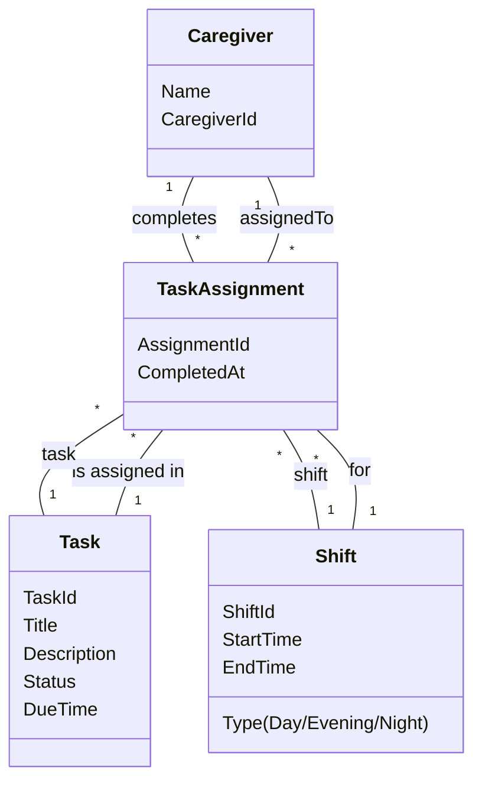

# Domain Model (DM) for Dashboard TaskList
## Metadata
| Key               | Value                             |
|-------------------|-----------------------------------|
| Id                | UC-006.DM                        |
| crossReference    | BC                                |

## Version Log
| Version | Date       | Description              | Author     |
|---------|------------|--------------------------|------------|
| 0001    | 2026-04-10 | Initial                  | Team 6     |

## Assumptions and Dependencies
- Each task is assigned to a staff member for a specific shift.
- Task status is updated in real time and can be completed, in progress, or pending.
- A staff member can have multiple tasks per shift.
- Tasks are only visible for the current shift context.

## Terms Translation
| Original Term   | Danish Translation |
|-----------------|-------------------|
| Task            | Opgave            |
| TaskList        | Opgaveliste       |
| Caregiver       | Omsorgsperson     |
| Shift           | Vagt              |
| Status          | Status            |
| Complete        | Afslutte          |
| Assigned        | Tildelt           |
| Update          | Opdatere          |
| Real time       | Realtid           |
