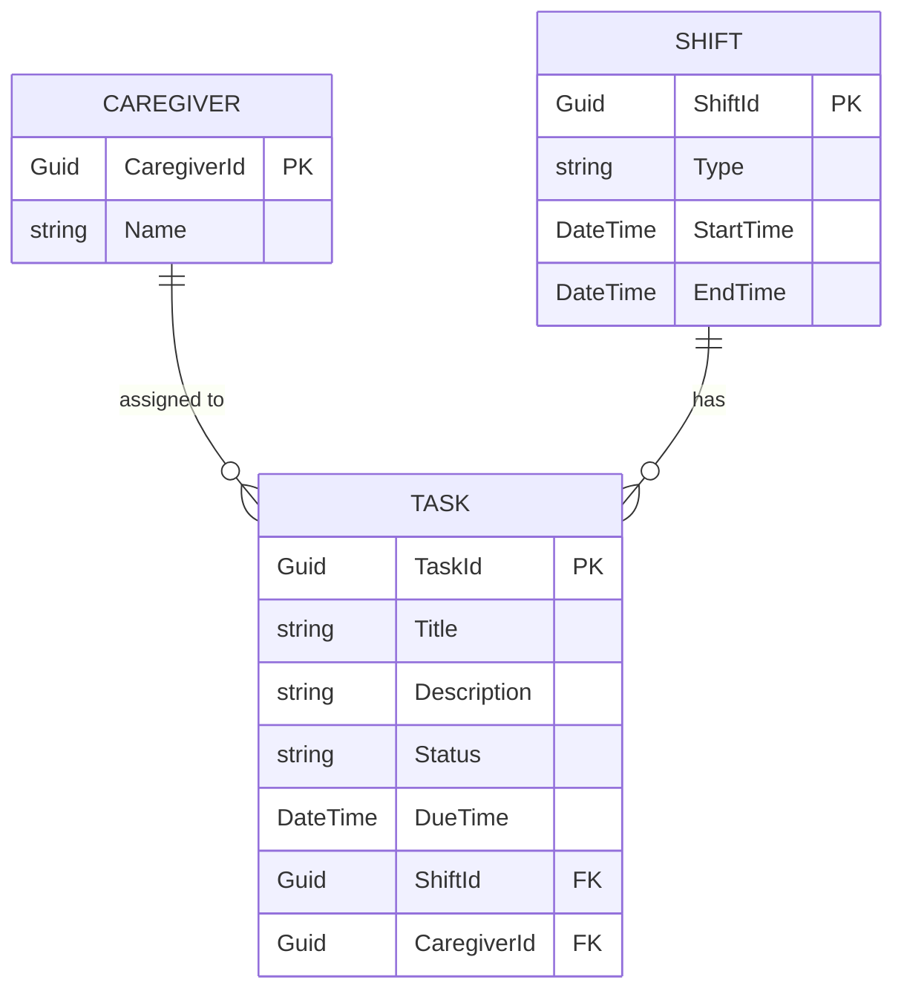

# Entity Relationship Diagram (ERD) for Dashboard TaskList

## Metadata
| Key            | Value           |
|----------------|-----------------|
| Id             | UC-006.ERD      |
| crossReference | UC-006.DCD      |

## Version Log
| Version | Date       | Description | Author |
|---------|------------|-------------|--------|
| 0001    | 2026-04-10 | Initial     | Team 6 |

## Notes
- PK = Primary Key, FK = Foreign Key.
- Each Task is assigned to a Caregiver and belongs to a Shift.
- Relationships and attributes are derived from the DCD and domain model.
- Status is a string for simplicity; in implementation, it may be an enum.
