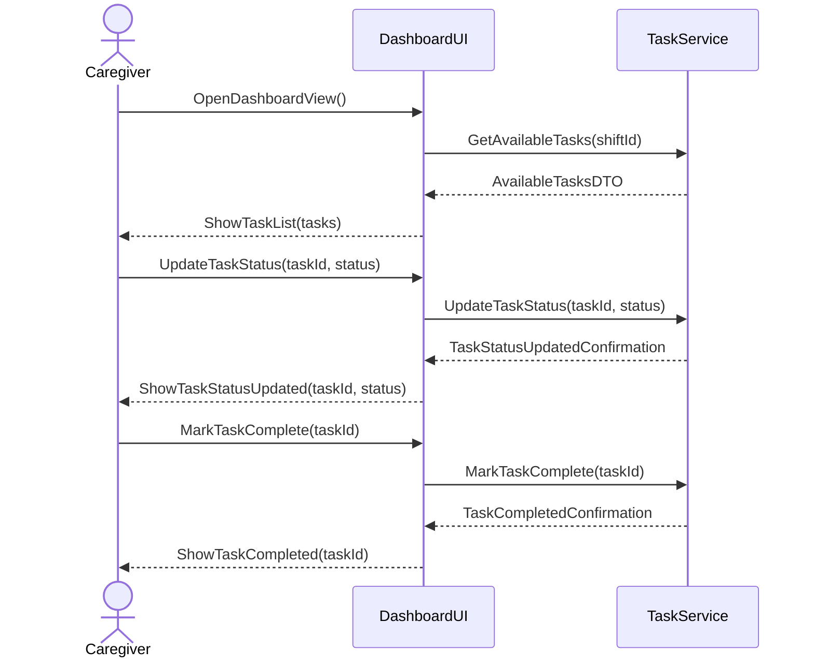
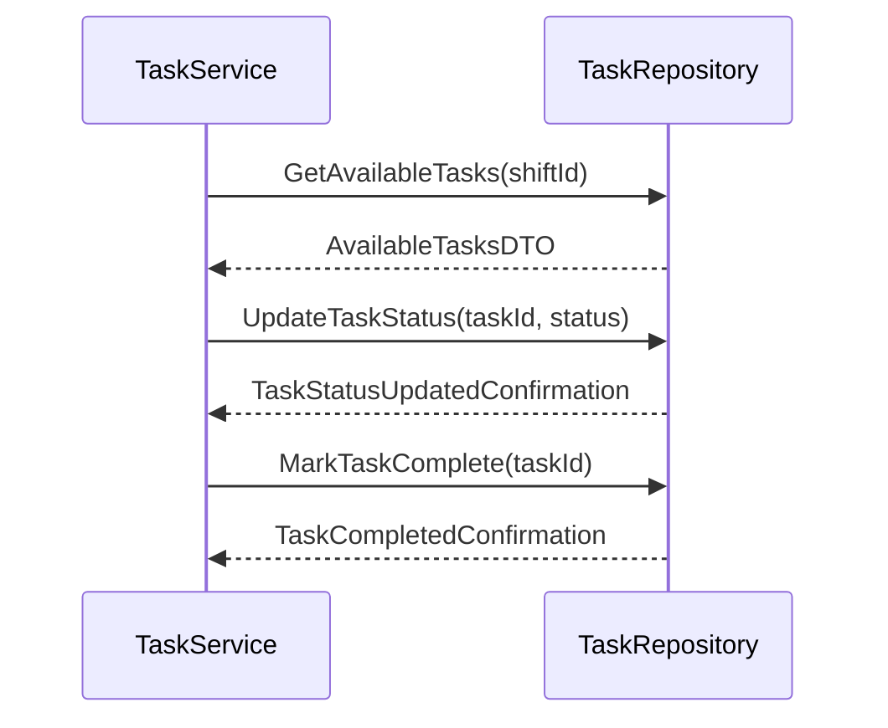

# Sequence Diagram: TaskList Management

## Metadata
| Key            | Value           |
|----------------|-----------------|
| Id             | UC-006.SD       |
| crossReference | UC-006.OC       |

## Version Log
| Version | Date       | Description | Author |
|---------|------------|-------------|--------|
| 0001    | 2026-04-10 | Initial     | Team 6 |

## Presentation Layer → Application Layer

## Application Layer → Infrastructure Layer (Data Access)

## Notes
- DTOs are used for data transfer between layers.
- No direct database or internal system calls are shown; all data access is abstracted via TaskRepository.
- All method names use PascalCase and parameters are shown in parentheses.
