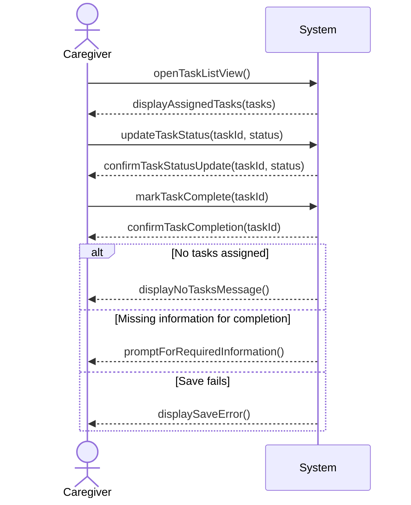

## Metadata
| Key            | Value           |
|----------------|-----------------|
| Id             | UC-006.SSD      |
| crossReference | UC-006 UC-006.DM|

## Version Log
| Version | Date       | Description | Author |
|---------|------------|-------------|--------|
| 0001    | 2026-04-10 | Initial     | Team 6 |

## System Sequence Diagram

## Language Translation
| Original Term   | Danish Translation |
|-----------------|-------------------|
| Task            | Opgave            |
| TaskList        | Opgaveliste       |
| Caregiver       | OmsorgsPerson     |
| Status          | Status            |
| Complete        | Afslutte          |
| Assigned        | Tildelt           |
| Update          | Opdatere          |
| Real time       | Realtid           |
